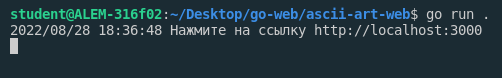
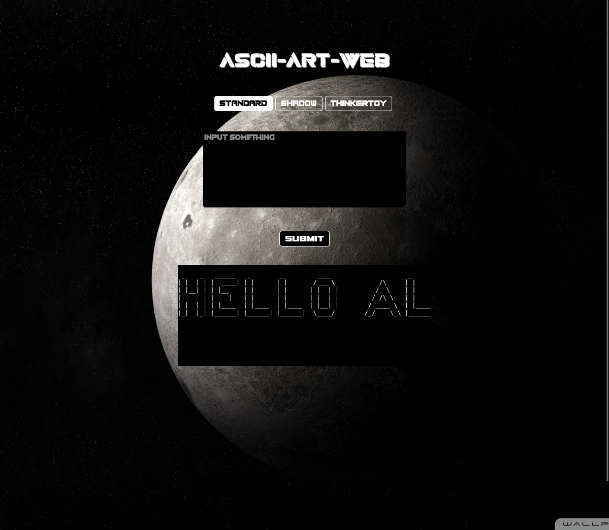

## ascii-art-web

# Description:
This project receives a string as an argument and outputs the string in a graphic representation using ASCII. And prints the output via three banners: standard, shadow and thinkertoy.
# Authors:
@Tursynkhan
# Usage:
1. To run program use  the following command

```bash
  go run ./cmd/web
```


2. Open the web browser and go to 

```bash
  http://localhost:4000
```

3. Write anything in the textarea:
```bash
  "Hello, Alem!"
```
4. Choose banner:

```bash
  standard (checked)

  thinkertoy

  shadow
```
5. Check result:
      

# IMPLEMENTATION: 

  1.  Write a server.go / actually a server.

 2.   Implement ascii-art-fs to server.

   3. Code an html page and style it!

 4.   Optimize and handle all errors.
